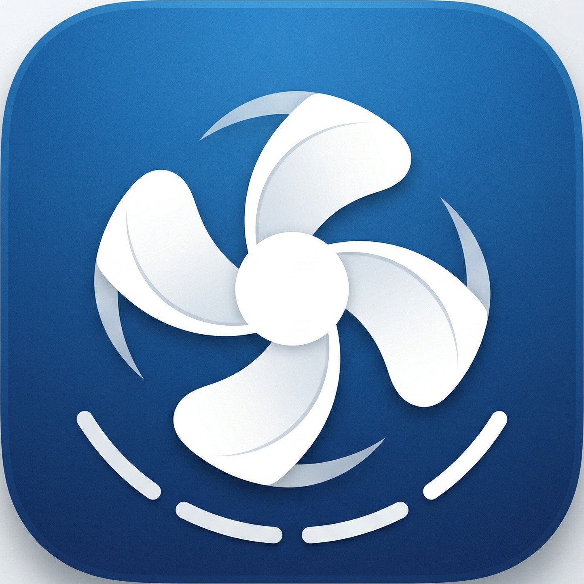

<p align="center">
  
</p>

<h1 align="center">MacFanControl</h1>

<p align="center">
  A native macOS menu bar app for monitoring temperatures and controlling fan speeds on Apple Silicon Macs.
</p>

<p align="center">
  
  
  
  
</p>

---

## Features

- **Real-time monitoring** — Reads 400+ SMC temperature sensors and fan RPM directly, no kernel extensions required
- **Menu bar integration** — Lives in the menu bar with a compact status dropdown; Dock icon only appears when the dashboard is open
- **Manual fan control** — Set custom RPM, full speed, or auto per fan via a privileged helper daemon
- **Temperature-based profiles** — Create named profiles with rules like "if sensor X reaches Y degrees, set fan Z to W rpm"
  - Hysteresis with 3°C deadband prevents rapid toggling
  - Highest RPM wins when multiple rules target the same fan
  - Fans return to auto when no rules trigger
- **Safe by design**
  - Read-only monitoring requires no privileges
  - Fan writes go through a separate privileged helper with a 10-second watchdog — if the app crashes, fans revert to auto
  - RPM values are double-clamped (evaluator + helper)
  - Taking fan control is an explicit, acknowledged action

## Requirements

- macOS 14.0 (Sonoma) or later
- Apple Silicon Mac (M1 / M2 / M3 / M4 / M5 series)
- No Xcode installation required — only the Swift toolchain (`/usr/bin/swift`)

## Building

```bash
# Build the app bundle (release, ad-hoc signed)
bash scripts/build.sh
```

The app bundle is assembled at `build/MacFanControl.app`.

## Installation

### 1. Install the privileged helper

The helper daemon runs as root and handles all fan write operations. Install it once:

```bash
sudo bash scripts/install-helper.sh
```

This copies the helper binary to `/Library/PrivilegedHelperTools/` and registers a launchd service.

### 2. Launch the app

```bash
open build/MacFanControl.app
```

Or copy `build/MacFanControl.app` to `/Applications/`.

### Uninstalling the helper

```bash
sudo bash scripts/uninstall-helper.sh
```

## Usage

1. **Monitor** — The dashboard shows all detected temperature sensors and fan speeds. No privileges needed.
2. **Take fan control** — Click "Take fan control..." in the dashboard or menu bar. This activates the privileged helper.
3. **Manual control** — Use the slider to set a custom RPM, or click "Full speed" / "Auto" per fan.
4. **Profiles** — Create temperature-based profiles that automatically adjust fan speeds:
   - Select a profile from the dropdown in the Fans panel or the menu bar "Profiles" submenu
   - Each rule maps a sensor threshold to a target RPM for a specific fan
   - Profiles are persisted to `~/Library/Application Support/MacFanControl/profiles.json`

## Architecture

```
┌─────────────────────┐     ┌──────────────────────────┐
│  MacFanControlApp   │     │  MacFanControlHelper     │
│  (SwiftUI GUI)      │────▶│  (launchd root daemon)   │
│                     │ XPC │                          │
│  • SMC reads (user) │     │  • SMC writes (root)     │
│  • Profile engine   │     │  • 300ms reconciliation   │
│  • Menu bar extra   │     │  • 10s watchdog           │
└─────────────────────┘     └──────────────────────────┘
         │                              │
         └──────────┬───────────────────┘
                    ▼
            ┌──────────────┐
            │  AppleSMC    │
            │  (IOKit)     │
            └──────────────┘
```

- **MacFanControlCore** — Shared library: SMC access (via C shim), fan/sensor readers, protocol definitions, profile evaluator
- **MacFanControlApp** — SwiftUI app with menu bar extra, dashboard, profile editor
- **MacFanControlHelper** — Privileged launchd daemon for fan writes, communicates via `NSXPCConnection`
- **SMCShim** — Minimal C target wrapping IOKit's `SMCKeyData_t` struct

## Apple Silicon SMC Notes

On M-series Macs, the SMC driver has specific behaviors:

- Fan RPM keys use `flt` type (IEEE 754 float), not the `fpe2` format from Intel Macs
- Writing `F0md=1` (manual mode) triggers a **session-scoped latch** — auto-mode reads become degraded until reboot
- `thermalmonitord` clobbers `F0Tg` every ~1.4 seconds, so the helper uses a 300ms reconciliation loop to maintain custom targets
- Reads work as a normal user; writes require root

## License

MIT
